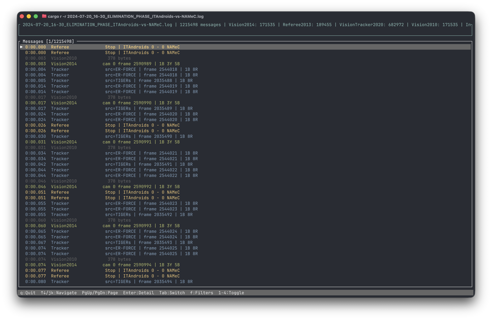

# loguna

<p align="center">
    
</p>

A Rust library and TUI tool for working with RoboCup SSL log files. If you've
ever stared at a `.log` or `.log.gz` file from an SSL game and wished you could
just *read the thing*, this is for you.

The project is split into two crates:

- **`loguna`** — the core library for reading and writing SSL log files
- **`loguna-viewer`** — a terminal UI (and CLI) built on top of it

---

## What's an SSL log file?

The [RoboCup Small Size League](https://ssl.robocup.org/) uses a binary log
format to record game data — vision frames, referee commands, tracked positions,
all of it. The format is pretty simple on paper: a magic header, then a stream
of length-prefixed protobuf messages. In practice though, parsing it correctly
means dealing with multiple message types across different format generations,
optional gzip compression, and an optional random-access index tacked on at the
end.

`loguna` handles all of that so you don't have to.

---

## The library (`loguna`)

Add it to your project:

```toml
[dependencies]
loguna = { git = "https://github.com/Technulgy-LGNU/loguna" }
prost = "0.13"
```

### Reading a log file

```rust
use loguna::{LogReader, MessageId};
use loguna::proto::SslWrapperPacket;
use prost::Message;

let mut reader = LogReader::open("game.log")?;

while let Some(msg) = reader.next_message()? {
    match msg.message_id {
        MessageId::Vision2014 => {
            let packet = SslWrapperPacket::decode(msg.payload.as_slice())?;
            if let Some(det) = packet.detection {
                println!("frame {} | camera {}", det.frame_number, det.camera_id);
            }
        }
        MessageId::Referee2013 => {
            let referee = loguna::proto::Referee::decode(msg.payload.as_slice())?;
            println!("command: {:?}", referee.command());
        }
        _ => {}
    }
}
```

Gzip-compressed `.log.gz` files are detected automatically by extension and
decompressed on the fly — no extra setup needed.

### Random access

For non-compressed files that have an index appended, you can jump directly to
any message by byte offset instead of scanning the whole file:

```rust
if reader.is_indexed() {
    let offsets = reader.read_index()?;
    // jump to message 500 directly
    let msg = reader.read_message_at(offsets)?;
}
```

### Writing

```rust
use loguna::{LogWriter, LogMessage, MessageId};

let mut writer = LogWriter::create("output.log")?;
writer.write_message(&LogMessage {
    timestamp_ns: 1_700_000_000_000_000_000,
    message_id: MessageId::Vision2014,
    payload: some_encoded_proto_bytes,
})?;
```

### Supported message types

| ID | Name | Description |
|----|------|-------------|
| 2  | `Vision2010` | Legacy SSL-Vision format |
| 3  | `Referee2013` | Game controller / referee messages |
| 4  | `Vision2014` | Current SSL-Vision wrapper |
| 5  | `VisionTracker2020` | Tracked object detection |
| 6  | `Index2021` | In-file random-access index |

---

## The viewer (`loguna-viewer`)

A terminal UI for browsing log files, plus a few CLI subcommands for when you
just want to pipe data somewhere.

### Build

```sh
cargo build --release -p loguna-viewer
# binary ends up at ./target/release/loguna-viewer
```

### TUI

```sh
loguna-viewer game.log
# or equivalently:
loguna-viewer tui game.log
```

Navigate with arrow keys or `j`/`k`. Press `Enter` to expand a message, `Tab`
to switch tabs. Filter by message type with `f` or the number keys:

- `1` — Vision (2014)
- `2` — Referee
- `3` — Tracker
- `4` — Vision (2010)

`q` or `Ctrl+C` to quit.

### CLI subcommands

**`stats`** — quick summary of what's in a file:
```sh
loguna-viewer stats game.log
```

**`dump`** — stream messages to stdout, filterable by type and time window:
```sh
# get the first 100 vision frames between t=10s and t=20s
loguna-viewer dump game.log -t vision -n 100 --after 10 --before 20

# full protobuf detail, JSON-ish output (good for feeding into other tools)
loguna-viewer dump game.log -f full -d
```

**`referee`** — print referee commands, optionally only showing state changes:
```sh
loguna-viewer referee game.log --changes-only
```
